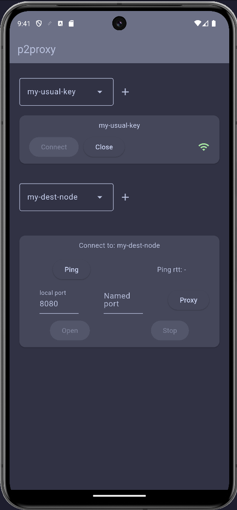
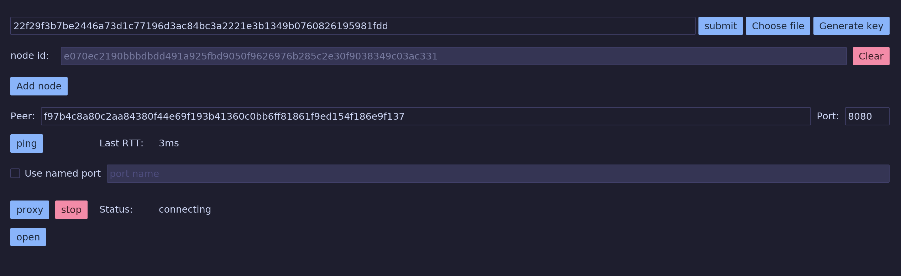

# P2proxy

A peer-to-peer TCP proxy built with [iroh](https://github.com/n0-computer/iroh).

## Serve TCP to devices, without opening extra ports, a static ip, or buying a domain

I made this project to remote-control my raspberry pi. It runs a few web-servers that I want to
visit while not on the local network. Iroh makes it possible to do that by dialing a public key.

### Daemon

The project consists of a daemon running on the server-device, and a few different clients that can
communicate with that daemon. The daemon itself is a very simple TCP-proxy with some optional access controls.
That daemon is (through configuration) pointed to a local port, and then proxies incoming traffic to and from
that prot.

#### Usage

The daemon can be run on the cli, or with a service manager like [systemd](https://systemd.io/), an example
systemd unit can be found [here](assets/p2proxyd.service).

The simplest possible configuration looks like this:

```toml
# Node id: 7003b83df94765d4862185187508055e11be90d761663061e4f368d076b7a9b8
secret_key_hex = "11701920da9f96a52625963997db5bc54e27ea86b00094646e2e860c4a8fa796"
allow_any_peer = true
default_route = "default"

[[server_ports]]
port = 8080
name = "default"
allow_any_peer = true
```

A secret key can be generated with `p2proxy-cli generate-key --dest <out-file>`,
or a skeleton configuration with `p2proxyd generate-template-configuration --dest <out-file>`.

Then running `./p2proxyd run --cfg-path <path>` will start the proxy, pointing at local port `8080`,
connectable using the public key/node id:
`7003b83df94765d4862185187508055e11be90d761663061e4f368d076b7a9b8`. It allows anyone to connect. Meaning,
anyone who knows about the node id `7003b83df94765d4862185187508055e11be90d761663061e4f368d076b7a9b8` can
connect to the local server from the internet.

A client (using the CLI) could connect to that port using:

```shell
p2proxy-cli run --key-hex 761f433bc4e34277f3be1fb27e0198981d9a830d81c4aa468aa169413645123f \
--peer 7003b83df94765d4862185187508055e11be90d761663061e4f368d076b7a9b8 --local-port 3000
```

And then open the browser at `http://localhost:3000` to view what's served at port `8080` on the server device.

For more usage/configuration of the daemon, see [its readme](./p2proxyd/Readme.md)

## Android app

An android app `p2proxy` is currently under review,
it can be used to connect to a remote `p2proxyd` service.



## Desktop app



See its readme for more details [here](./p2proxy-desktop/Readme.md).

## Building

To build, you need a rust toolchain, you can get one [through rustup](https://rust-lang.org/tools/install/) for
example.

You need `libglib2.0-dev` and `libgtk-3-dev` to build the desktop app. The proxy and cli does not need these
extra dependencies (as far as I'm aware).

### Daemon

`cargo b -r -p p2proxyd`, binary ends up in `target/release/p2proxyd`

### CLI

`cargo b -r -p p2proxy-cli`, binary ends up in `target/release/p2proxy-cli`

### Desktop

`cargo b -r -p p2proxy-desktop`, binary ends up in `target/release/p2proxy-desktop`

### Android app

Can be built using flutter:

To build release, you need to set up signing-configs,
[see the flutter docs](https://docs.flutter.dev/deployment/android#configure-signing-in-gradle)

```shell
cd p2proxy_fl && flutter build appbundle --debug
```

## License

This project is licensed under [GPLv3](./LICENSE).

## Attribution

[Feature-graphic](assets/images/android-feature.png) generated with https://hotpot.ai/design/google-play-feature-graphic